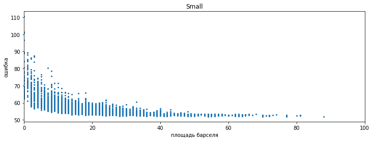
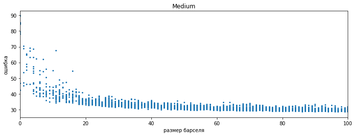
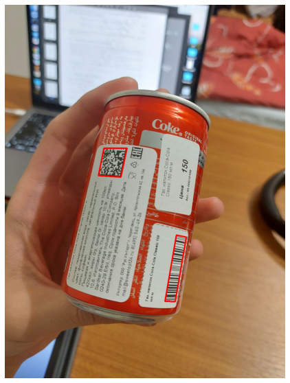

# Отчёт по аугментатору

Ссылка на репозиторий: [https://github.com/valkon29/mipt2024f_konovalov_v_r](https://github.com/valkon29/mipt2024f_konovalov_v_r)

Автор: Коновалов Валентин

## Input/Output
Вход:

- набор изображений
- файл с разметкой, полученной с помощью [VGG Image Annotator](https://annotate.officialstatistics.org/). Для каждой картинки она представляет из себя набор точек, которые обозначают полигон вокруг штрих-кода. Помимо этого в атрибутах прусутствует тип кода и метка валидности (за подробностями см. пример в репозитории).

Выход:

- набор изображений, полученных из входных путём некоторых искажений
- разметка в том же формате, что и на входе

## Данные

Помимо работы над аугментатором мной были сделаны и размечены размечены __150__ фотографий штрихкодов. Их можно найти в вышеупомянутом репозитории в папке _images_. Формат разметки можно подробно изучить в этом репозитори: [github.com/CD7567/mipt2024f-4-common-knowledge](https://github.com/CD7567/mipt2024f-4-common-knowledge/blob/master/annotation/annotation.md). Она учитывает ориентацию кода, его тип и валидность.

## API

Исполняемый файл _main.py_, ему на вход подаются путь к папке с изображениями, путь к файлу и число, задающее кол-во изображений, которое необходимо получить из каждого исходного посредством аугментации:

```
python3 main.py images via_project_9Nov2024_20h28m_.json 2
```

Полученные изображения будут сохранены в папку _augmented images_, а разметка в файл _augmented_markup.json_. Формат выходной разметки совпадет со входным.

Сама операция искажения, применяемая к входным изображениям, захардкожена внутри файла _main.py_. В будущем планируется в какой-то степени перенести список искажений и их параметров в какой-нибудь конфиг.

## Проективное искажение

Для исследования этих искажений на данном этапе были взяты синтетические изображения qr-кодов. Они деформировались в результате проективного преобразования, а затем путём обратного преобразования приводились к исходному прямоугольному виду.

В качестве меры деформированности бралась минимальная площадь барселя в углу изображения после искажения. Чем она меньше, тем мильнее искажение. За метрику близости между исходным кодом и изображением, полученным в результате обратного преобразования, была взята L1-норма разницы в grayscale (только по области бар-кода).

Соответственнно процедура искажения многократно запускалась на одном изображении, считалась мера искажения и близость итогового изображения к исходному.

На qr-коде низкого разрешения:

<div class='container'>
    
</div>

Пример сильного искажения:

<div class='container'>
    
    
    
</div>

На qr-коде среднего разрешения:

<div class='container'>
    
</div>

Пример сильного искажения:

<div class='container'>
    
    
    
</div>

На qr-коде среднего разрешения:

<div class='container'>
    
</div>

Пример сильного искажения:

<div class='container'>
    
    
    
</div>

По моим наблюдениям потеря информации, то есть серьёзные отличия с исходным изображенем начинаются примерно на площади в 15 пикселей. Этот резльутат можно перенести и на коды типа datamatrix. 

## Искажения из albumentations

Здесь приведены некоторые наиболее актуальные искажения посредством библиотеки [albumentations](https://albumentations.ai/docs/). Она поддерживает работу с ключевыми точками, масками и bounding_box-ами.

- __Rotate__: поворот на угол от 0 до 360 градусов

<div class='container'>
    
    
</div>

- __GaussNoise__: шум из нормального распределения, применяется отдельно для каждого пикселя и для каждого канала (хотя это можно настроить)

<div class='container'>
    
    
</div>

- __GaussianBlur__: свёртка с гауссовским ядром

<div class='container'>
    
    
</div>

Кроме того, была создана [таблица](https://docs.google.com/spreadsheets/d/1PcWqvZCe95tcm1lzSWeyEqdJK_wRV9SHoov22B2F4M4/edit?gid=0#gid=0) со всеми искажениями, которые потенциально нам могут пригодиться.
В столбцах присутствуют оценка релевантности отдельных искажений для нашей задачи по 10-бальной шкале, а также местами их краткое описание и допустимые границы параметров. _По многим из них пока есть сомнения, таблица заполнена не полностью_.

Столбец _limits depend on image_ для отдельных искажений даёт информмацию о том, зависят ли допустимые границы искажения от конкреного фото. К примеру, из вышеупомянутых, границы Perspective или Rotate от изображения особо не зависят, в то время как у GaussianBlur и MotionBlur эта зависмость очень явная, чем качетсвеннее было исходное фото, тем сильнее его потом можно размывать. И что делать с такими искажениями, на данный момент, скорее неясно.

## Некоторые детали
- На данный момент, если при искажении, хоть одна точка разметки кода выходит за границы полученного изображения, код считается не валидным и в разметке это отражается. В дальнейшем можно сделать умнее
- Можно задавать композицию из произвольного числа искажений, при этом задавая вероятности каждого из них. По умолчанию они применяются с вероятностью 0.5
- При всех искажениях, которые нарушают "прямоугольность" картинки, всё лишнее обрезалось. Из вышеупомянутых к таковым относятся Rotate и Perspective. Потенциально образовавшиеся области можно, например, заполнять зеркально отражённым содержанием исходной картинки

## Зависимости
Исключительно питоновские библиотеки, которые можно установить, например, с помощью утилиты PyPI:
- OpenCV
- albumentations
