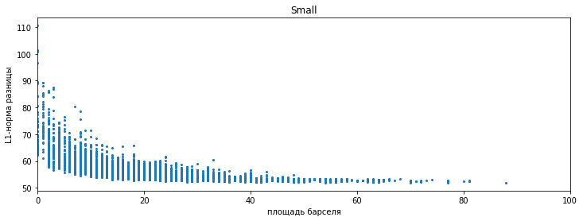
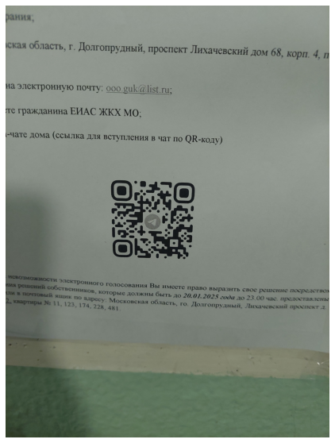
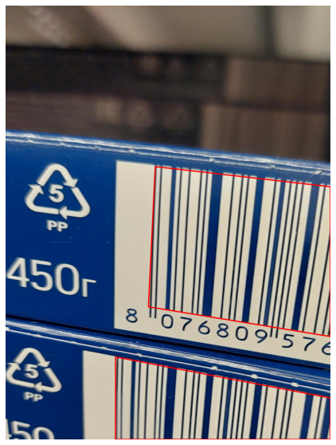

# Отчёт по аугментатору

Ссылка на репозиторий: [https://github.com/valkon29/mipt2024f_konovalov_v_r](https://github.com/valkon29/mipt2024f_konovalov_v_r)

Автор: Коновалов Валентин

## Input/Output
Вход:

- набор изображений
- файл с разметкой, полученной с помощью [VGG Image Annotator](https://annotate.officialstatistics.org/). Для каждой картинки она представляет из себя набор точек, которые обозначают полигон вокруг штрих-кода. Помимо этого в атрибутах прусутствует тип кода и метка валидности (за подробностями см. пример в репозитории).

Выход:

- набор изображений, полученных из входных путём некоторых искажений
- разметка в том же формате, что и на входе

## Данные

Помимо работы над аугментатором мной были сделаны и размечены размечены __150__ фотографий штрихкодов. Их можно найти в вышеупомянутом репозитории в папке _images_. Формат разметки можно подробно изучить в этом репозитори: [github.com/CD7567/mipt2024f-4-common-knowledge](https://github.com/CD7567/mipt2024f-4-common-knowledge/blob/master/annotation/annotation.md). Она учитывает ориентацию кода, его тип и валидность.

## API

Исполняемый файл _main.py_, ему на вход подаются путь к папке с изображениями, путь к файлу и число, задающее кол-во изображений, которое необходимо получить из каждого исходного посредством аугментации:

```
python3 main.py images via_project_9Nov2024_20h28m_.json 2
```

Полученные изображения будут сохранены в папку _augmented_images_, а разметка в файл _augmented_markup.json_. Формат выходной разметки совпадет со входным

## Искажения

Можно выделить несколько наиболее важных классов искажений:
- геометрические
- размытия
- изменения освещенности
- шумы

Далее рассмотрим их по-отдельности

## Геометрические искажения 

### - проективное искажение

Оно задаётся с помощью образов 4-х точек, по ним вычисляется матрица преобразования и оно применяется ко всему изображению.

В библиотеке [albumentations](https://albumentations.ai/docs/) есть готовый метод, который выполняет искажения такого рода. У него есть параметр scale, который определяет допустимую степень искажения. Эксперименты показываю, что не слишком серьёзные искажения проявляются при значении scale не ,более 0.4 (он принимает значения от 0 до 1). Пример результата работы данной функции:

<div class='container'>
    
    
</div>

Чтобы производить более экстремальные проективные искажения, надо быть уверенными, что не произойдёт потеря информации и после ректификации (обратного преобразования) код будет читаемый.

Для выявления допустимых были взяты синтетические изображения qr-кодов. Они деформировались в результате проективного преобразования, а затем путём обратного преобразования приводились к исходному прямоугольному виду. В качестве меры деформированности бралась минимальная площадь барселя в углу изображения после искажения. Чем она меньше, тем сильнее искажение. За метрику близости между исходным кодом и изображением, полученным в результате обратного преобразования, была взята усреднённая L1-норма разницы в grayscale (только по области штрихкода).

Соответственнно процедура искажения многократно запускалась на одном изображении, считалась мера искажения и близость итогового изображения к исходному.

На qr-коде низкого разрешения:

<div class='container'>
    
</div>

Пример искажения:

<div class='container'>
    
    
    
</div>

<br>

На qr-коде среднего разрешения:

<div class='container'>
    
</div>

Пример искажения:

<div class='container'>
    
    
    
</div>

На qr-коде высокого разрешения:

<div class='container'>
    
</div>

Пример искажения:

<div class='container'>
    
    
    
</div>

По моим наблюдениям, потеря информации, то есть серьёзные отличия с исходным изображенем после обратного преобразования начинаются примерно на площади в 15 пикселей. Этот резульутат можно перенести и на коды типа datamatrix.

Однако, поскольку на размеченных нами информация о размерах отдельных барселей или какой-то другой характерный размер отсутствует, использовать данные результаты для аугментации пока не получится и мы можем применять только не очень сильные проективные искажения. 

### - поворот

Метод Rotate из библиотеки [albumentations](https://albumentations.ai/docs/). Поворот на случайный угол. При этом всё лишнее, что нарушает прямоугьность картинки, обрезается. Потенциально можно ещё отражать зеркально.

<div class='container'>
    
    
</div>

## Размытия

Главная проблема данного типа искажений заключается в том, что допустимые размеры ядер размытия очень сильно зависят от входного изображения, а именно от его размершения, размеров и резкости кода на нём. Поэтому подбирать их определённо надо под каждое изображение отдельно.

### - размытие гауссовским ядром

Мы ограничимся лишь довольно примитивным решением данной проблемы в случае гауссовского ядра. Будем считать характреный размер штрих-кода как максимальную его диагональ в пикселях и далее умножать это значение на некоторый коэффициент, таким образом получая наибольший допустимый размер ядра. Эмпирически было получено оптимальное значение в 0.05 для этого коэффициента. При таком значении размытие зачастую заметно, но всё ещё не нарушает валидность. Однако на некоторых изображения можно было бы взять значение и больше, это недостаток такого подхода.

Для осуществления размытия Метод GaussianBlur из библиотеки [albumentations](https://albumentations.ai/docs/).

<div class='container'>
    
    
</div>

## Изменения освещенности

Здесь используем метод RandomBrightnessContrast из той же [albumentations](https://albumentations.ai/docs/). Меняет яркость и контрастность, тем самым симулируя различные условия освещения. Границы подбирались на глаз и от конкретного изображения не зависят (brightness_limit=(-0.5, 0.5), contrast_limit=(-0.3, 0,3)).

<div class='container'>
    
    
</div>

## Шумы

Здесь допустимые границы искажения в меньшей мере зависят от входного изображения, чем при том же размытии, поэтому они были выбраны эмпирически на глаз и одинаковы для всех входных изображений

### - гауссовский шум

Метод GaussNoise из библиотеки [albumentations](https://albumentations.ai/docs/). Допустимые границы: std_range <= 0.4

<div class='container'>
    
    
</div>

### - ISONoise

Одноимённый метод из albumentations, который симулирует шум, возникающий при высоких значениях ISO. Допустимые границы: intensity <= 0.5

<div class='container'>
    
    
</div>

## Некоторые детали
- На данный момент, если при искажении хоть одна точка разметки кода выходит за границы полученного изображения, код считается невалидным. Разметка при этом остаётся корректной, за счёт добавления новых точек на границах (это было реализовано мной вручную, так как в библиотеке такая логика не поддерживалась). Пример:

<div class='container'>
    
    
</div>

- к входным изображениям применяется компоозиция из всех вышеупомятух искажений. При этом у каждого отдельного искажения выставляется вероятность его применения. Для проективного преобразования и поворота она равна 0.7, для размытия 0.5, для освещённости 0.5, для шумов 0.3 Такие значения взяты из общих соображений и могут быть изменены при желании.

## Зависимости
Исключительно питоновские библиотеки, которые можно установить, например, с помощью утилиты PyPI:
- OpenCV
- albumentations
