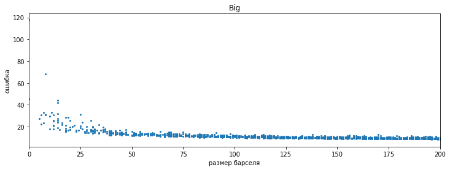

# Отчёт по аугментатору

Ссылка на репозиторий: [https://github.com/valkon29/mipt2024f_konovalov_v_r](https://github.com/valkon29/mipt2024f_konovalov_v_r)

Автор: Коновалов Валентин

## Input/Output
Вход:

- набор изображений
- файл с разметкой, полученной с помощью [VGG Image Annotator](https://annotate.officialstatistics.org/). Для каждой картинки она представляет из себя набор точек, которые обозначают полигон вокруг штрих-кода. Помимо этого в атрибутах прусутствует тип кода и метка валидности (за подробностями см. пример в репозитории).

Выход:

- набор изображений, полученных из входных путём некоторых искажений
- разметка в том же формате, что и на входе

## Данные

Помимо работы над аугментатором мной были сделаны и размечены размечены __150__ фотографий штрихкодов. Их можно найти в вышеупомянутом репозитории в папке _images_. Формат разметки можно подробно изучить в этом репозитори: [github.com/CD7567/mipt2024f-4-common-knowledge](https://github.com/CD7567/mipt2024f-4-common-knowledge/blob/master/annotation/annotation.md). Она учитывает ориентацию кода, его тип и валидность.

## API

Исполняемый файл _main.py_, ему на вход подаются путь к папке с изображениями, путь к файлу и число, задающее кол-во изображений, которое необходимо получить из каждого исходного посредством аугментации:

```
python3 main.py images via_project_9Nov2024_20h28m_.json 2
```

Полученные изображения будут сохранены в папку _augmented images_, а разметка в файл _augmented_markup.json_. Формат выходной разметки совпадет со входным.

Сама операция искажения, применяемая к входным изображениям, захардкожена внутри файла _main.py_. В будущем планируется в какой-то степени перенести список искажений и их параметров в какой-нибудь конфиг.

## Проективное искажение

Для исследования этих искажений на данном этапе были взяты синтетические изображения qr-кодов. Они деформировались в результате проективного преобразования, а затем путём обратного преобразования приводились к исходному прямоугольному виду.

В качестве меры деформированности бралась минимальная площадь барселя в углу изображения после искажения. Чем она меньше, тем сильнее искажение. За метрику близости между исходным кодом и изображением, полученным в результате обратного преобразования, была взята L1-норма разницы в grayscale (только по области штрихкода).

Соответственнно процедура искажения многократно запускалась на одном изображении, считалась мера искажения и близость итогового изображения к исходному.

На qr-коде низкого разрешения:

<div class='container'>
    
</div>

Пример искажения:

<div class='container'>
    
    
    
</div>

На qr-коде среднего разрешения:

<div class='container'>
    
</div>

Пример искажения:

<div class='container'>
    
    
    
</div>

На qr-коде среднего разрешения:

<div class='container'>
    
</div>

Пример искажения:

<div class='container'>
    
    
    
</div>

По моим наблюдениям, потеря информации, то есть серьёзные отличия с исходным изображенем после обратного преобразования начинаются примерно на площади в 15 пикселей. Этот резульутат можно перенести и на коды типа datamatrix. Для одномерных кодов исследование пока не было проведено.

## Поворот

Метод Rotate из библиотеки [albumentations](https://albumentations.ai/docs/). Поворот на случайный угол. При этом всё лишнее, что нарушает прямоугьность картинки, обрезается. Потенциально можно ещё отражать зеркально.

<div class='container'>
    
    
</div>

## Освещение

Метод RandomBrightnessContrast из библиотеки [albumentations](https://albumentations.ai/docs/). Меняет яркость и контрастность, тем самым симулируя различные условия освещения. Границы подбирались на глаз и от конкретного изображения не зависят (brightness_limit=[-0.5, 0.5], contrast_limit=[-0.3, 0,3]).

<div class='container'>
    
    
</div>

## Размытие гауссовским ядром

Метод GaussianBlur из библиотеки [albumentations](https://albumentations.ai/docs/). При этом допустимые размеры ядра сильно зависят от конкретного изображения и пока это не было учтено.

<div class='container'>
    
    
</div>

## Гауссовский шум

Метод GaussNoise из библиотеки [albumentations](https://albumentations.ai/docs/). Выбрано просто некоторое адекватное значение степени шума, при котором большинство картинок остаются валидными. Подробного исследования тут не проводилось.

<div class='container'>
    
    
</div>

## Прочие искажения

Кроме того, была создана [таблица](https://docs.google.com/spreadsheets/d/1PcWqvZCe95tcm1lzSWeyEqdJK_wRV9SHoov22B2F4M4/edit?gid=0#gid=0) со всеми искажениями, которые потенциально нам могут пригодиться.
В столбцах присутствуют оценка релевантности отдельных искажений для нашей задачи по 10-бальной шкале, а также местами их краткое описание и допустимые границы параметров. _По многим из них пока есть сомнения, таблица заполнена не полностью_. Столбец _limits depend on image_ для отдельных искажений даёт информмацию о том, зависят ли допустимые границы искажения от конкреного фото.

## Некоторые детали
- На данный момент, если при искажении, хоть одна точка разметки кода выходит за границы полученного изображения, код считается не валидным и в разметке это отражается. В дальнейшем можно сделать умнее
- Можно задавать композицию из произвольного числа искажений, при этом задавая вероятности каждого из них. По умолчанию они применяются с вероятностью 0.5

## Зависимости
Исключительно питоновские библиотеки, которые можно установить, например, с помощью утилиты PyPI:
- OpenCV
- albumentations
